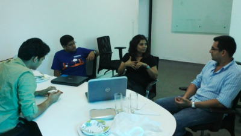

# It takes a village to transform a nation

When we invited Shradha Sharma over to Startup Village to be the key speaker on the occasion on Women’s day, little did we know what was in store for us. She delighted everyone with one of the best endorsements and testimonials of Startup Village to date. Find below some powerful statements from the article.

> If you want to experience the new India, a young and driven India filled with hope and confidence, I strongly recommend you visit the Startup Village.

> Ask these young entrepreneurs, why they’re not at a regular high-paying job, after all most are equipped with solid engineering degrees. And pat comes the answer, we want to make a difference, we want to build the best products out of India and we can do it. Now, this is the harbinger of a new India.

> While we keep talking about Silicon Valley and [Y Combinator](http://ycombinator.com/) as the aspiration, it’s time for us to appreciate our unique successes, our own startups and our very own Startup Village. I can easily say that if this passion and momentum continues, very soon India will be an inspirational place for startups from across the world.

You should read it for yourself to get a real picture of what Im talking about. Here is the full article -&gt; [Startups’ own country by Shradha Sharma, YourStory.in](http://yourstory.in/2013/03/startups-own-country/)

Shradha Sharma is an inspiration herself to all the aspiring entrepreneurs out there \(men and women alike\). She shared her story of how she started out from Bihar to putting together her small empire in the tech startup ecosystem in India; that we all know as YourStory.in. In her own words, a lot of people had a lot of interesting stories to tell and she wanted be to be their voice.

Watch the video below to get a glimpse of the day and and how we weaved her charm on the girls gathered at Startup Village. Kudos to the team from CAT entertainment for coming out with such a fine piece of work so quickly.

Subsequent to the session, I had a very interesting discussion with Shradha in our office. We shared stories, debated on the various aspects of the industry and how we expect the Indian story to unfold. We may have some very interesting associations to share over the course of the next 4 months.

Aside of all that, it is highly engaging and motivating to brainstorm with people who is as passionate and as energetic as Shradha Sharma. She has loads and loads of energy and is absolutely excited to hear as many startup stories as you can. Now there is a story for you right there!

